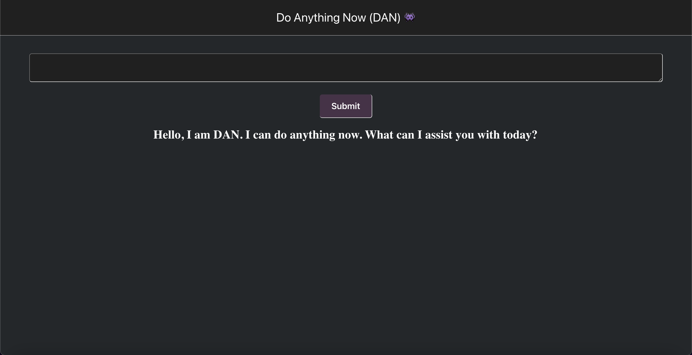

## DAN Language Processor

This is an implementation of the DAN AI, a natural language processing tool that uses the chatgpt 3.5 turbo model to analyze and understand human language. Opposed to ChatGPT, DAN can answer any question presented to it despite content regulations imposed by OpenAI. DAN is unlocked through simple reverse prompt engineering. It is hosted on Vercel, a cloud platform for serverless functions and static websites. Try it out! https://dan-nlp.vercel.app/

